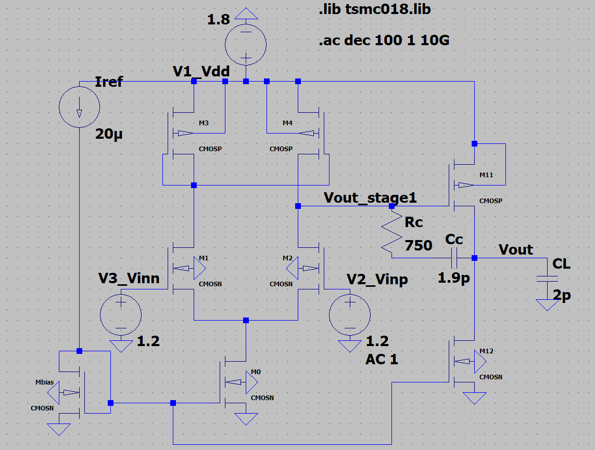
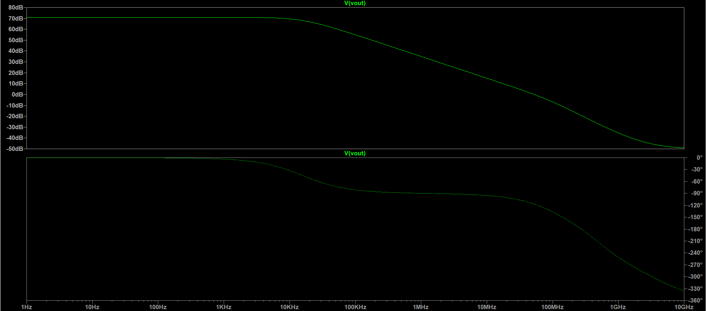

# Two-Stage CMOS Miller-Compensated Op-Amp

<div align="center">
  <!-- TODO: Upload your final op-amp schematic image to the images/ folder and uncomment the line below -->
  <!--  -->
</div>

This repository contains the complete design, simulation, and advanced characterization of a **Two-Stage Miller-Compensated Operational Amplifier** implemented in **TSMC 0.18µm CMOS** technology ($V_{dd} = 1.8\,\text{V}$, $C_L = 2.0\,\text{pF}$).

Designed with a strict focus on analog IC design principles, this project demonstrates how to perform exact first-order hand calculations, resolve deep-submicron short-channel effects in BSIM3v3, and verify the design using a **Dual-Verification Workflow** combining interactive LTspice GUI schematics with automated Python SPICE testbenches.

---

## 🙏 Acknowledgments & Academic Reference

This project is built upon the analog integrated circuit design curriculum and pedagogy of **Prof. Nagendra Krishnapura** (Department of Electrical Engineering, IIT Madras):

* 🎓 **NPTEL Course:** [Analog Integrated Circuit Design (NPTEL / IIT Madras)](https://nptel.ac.in/courses/117106030) — Comprehensive lecture series on core analog circuit theory.
* 🌐 **Teaching Homepage:** [Prof. Nagendra Krishnapura Teaching Page](https://www.ee.iitm.ac.in/~nagendra/teaching.html) — Course lecture slides, design assignments, and curriculum resources.
* 💻 **CAD & Simulation Info:** [CAD Resources & LTspice Setup](https://www.ee.iitm.ac.in/~nagendra/cadinfo.html) — Source of the TSMC 0.18µm BSIM3v3 model library ([`tsmc018.lib`](tsmc018.lib)), custom 4-terminal transistor symbols (`cmosn.asy`, `cmosp.asy`), and simulation guidelines.
* 📑 **Reference Slide Deck:** The reference slide deck [`docs/2_stage_opamp.pdf`](docs/2_stage_opamp.pdf) is part of his official Analog IC Design lecture notes (accessible from the Downloads / Assignments tab of the NPTEL course).

---

## 📖 Complete Design Guide & Mathematical Derivations

> [!IMPORTANT]
> **Must-Read for Analog IC Engineers & Recruiters:**  
> While this README provides a quick-start guide, the **core engineering depth, derivations, and physics-level insights** are documented in the comprehensive design guide.
> 
> 👉 **[Click here to open the Full Design Guide](docs/two_stage_opamp_design_guide.md)**
>
> **What you'll find inside the Design Guide:**
> 1. **Hand Calculations & Exact Quadratic:** Full analytical derivation of $C_c$ from the second-order transfer function, current allocations, and $V_{DSAT}$ overdrive targets.
> 2. **Short-Channel Physics & 7-Step Tuning Log:** Why initial sizing resulted in $62.8\,\text{dB}$ instead of $70\,\text{dB}$ due to BSIM3v3 channel-length modulation, and how increasing $L=0.5\,\mu\text{m}$ recovered $+8.2\,\text{dB}$ gain.
> 3. **Analytical Pole-Zero Mapping:** Mathematical derivations of dominant pole $p_1$, non-dominant pole $p_2$, zero-canceling resistor $R_c$, and LHP zero phase-lead boost.
> 4. **Theory vs Simulation Methodologies:** Exact mathematical equations compared side-by-side against Python SPICE raw-data extraction algorithms for Slew Rate, CMRR, PSRR, Noise, ICMR, and Settling Time.
> 5. **Interactive LTspice GUI Hover Targets:** Transistor-by-transistor DC bias point matrix with saturation margins for visual inspection.

---

## 🚀 Key Performance Metrics Achieved ($V_{dd}=1.8\text{V}$, $C_L=2\text{pF}$, $T=27^\circ\text{C}$)

* **Open-Loop DC Gain ($A_o$):** **$71.00\text{ dB}$** ($3550\,\text{V/V}$)
* **Gain-Bandwidth Product (GBW):** **$52.10\text{ MHz}$**
* **Phase Margin ($\phi_M$):** **$63.25^\circ$**
* **Large-Signal Slew Rate:** **$+53.68\text{ V}/\mu\text{s}$** (Rising), **$-36.11\text{ V}/\mu\text{s}$** (Falling)
* **1% Settling Time ($t_s$):** **$17.77\text{ ns}$**
* **Common-Mode Rejection (CMRR):** **$75.85\text{ dB}$** ($A_{cm} = -4.85\,\text{dB}$)
* **Power Supply Rejection ($\text{PSRR}^+$):** **$76.62\text{ dB}$** ($A_{vdd} = -5.62\,\text{dB}$)
* **Total Supply Current / Power:** **$258.64\text{ }\mu\text{A}$** / **$465.55\text{ }\mu\text{W}$** ($\le 500\,\mu\text{W}$ spec met)
* **Linear Input Common-Mode Range (ICMR):** **$0.17\text{ V to } 1.68\text{ V}$**

<div align="center">
  <!-- TODO: Upload your AC Bode Plot image to the images/ folder and uncomment the line below -->
  <!--  -->
</div>

---

## 📂 Repository File Structure

```text
├── docs/
│   ├── two_stage_opamp_design_guide.md  # Comprehensive design guide, derivations & tables
│   └── 2_stage_opamp.pdf                # Reference lecture slides by Prof. Nagendra Krishnapura
├── images/                              # Destination folder for GitHub README screenshots
│   ├── schematic.png                    # (To be uploaded: Master LTspice schematic)
│   └── bode_plot.png                    # (To be uploaded: AC Bode plot magnitude/phase)
├── *.asc                                # Interactive LTspice GUI Schematics
├── *.cir                                # SPICE Simulation Netlists
├── *.py                                 # Automated Python Extraction Scripts (PyLTSpice)
├── tsmc018.lib                          # TSMC 0.18µm BSIM3v3 Model Library
└── cmosn.asy / cmosp.asy                # Custom 4-Terminal MOSFET Symbols (D, G, S, B)
```

> [!IMPORTANT]
> **Why keep simulation files in the root folder?**  
> LTspice resolves custom symbol files (`.asy`) and technology models (`.lib`) relative to the schematic's directory. Keeping `.asc`, `.cir`, `.asy`, and `.lib` together in the root ensures that this project runs **100% out-of-the-box** for anyone cloning the repo, without broken library paths or symbol re-mapping.

---

## ⚙️ LTspice GUI Setup & Usage Instructions

> [!TIP]
> **Just Viewing or Simulating Existing Schematics?**  
> If you clone/download this repository, **you do NOT need to configure anything** — simply double-click any `.asc` file and click **Run**! All symbols, model inclusions, and simulation directives are already embedded and pre-configured.
>
> Sections **2** and **3** below are **only required if you want to build new schematics from scratch** within this project directory using the custom symbols and TSMC 0.18µm library.

### 1. File Placement & Library Dependencies
* The model file [`tsmc018.lib`](tsmc018.lib) and custom symbol files [`cmosn.asy`](cmosn.asy), [`cmosp.asy`](cmosp.asy) **must be kept in the same directory** as your `.asc` schematic files. If moved to subfolders, LTspice will fail with `Cannot find symbol cmosn` or `Cannot open model file`.

### 2. Adding & Editing SPICE Directives *(Only when creating new schematics from scratch)*
* Press the keyboard shortcut **`.`** (period) or navigate to **Edit ➔ SPICE Directive**.
* **Include the TSMC 0.18µm model library:**
  ```spice
  .include tsmc018.lib
  ```
* **Enter Simulation Directives:**
  * DC Operating Point: `.op`
  * AC Frequency Sweep: `.ac dec 100 1 10G`
  * Transient Step Response: `.tran 0.1n 300n`
  * Noise Analysis: `.noise V(out) V2 dec 100 1 100Meg`
* *Alternative:* You can also configure simulation modes visually via the menu bar: **Simulate ➔ Edit Simulation Cmd**.

### 3. Placing Custom 4-Terminal MOSFET Symbols (`cmosn` / `cmosp`) *(Only when creating new schematics from scratch)*
1. Press keyboard shortcut **`F2`** or **`P`** (or navigate to **Edit ➔ Component**).
2. In the component selection dialog, click the **Top Directory Dropdown** and choose the project workspace directory (where [`cmosn.asy`](cmosn.asy) and [`cmosp.asy`](cmosp.asy) are located).
3. Select `cmosn` (for 4-terminal NMOS) or `cmosp` (for 4-terminal PMOS) and place it on the canvas.
4. Right-click the placed transistor to set its dimensions (e.g. `L=0.5u W=11u`).

---

## 🛠️ Methodologies: The Dual-Verification Workflow

This project enforces a **Dual-Verification Workflow** to cross-validate analytical circuit theory with numerical simulation:

1. **Visual LTspice GUI Verification (`.asc`)**
   * Run `.op` on [`stage1_gui.asc`](stage1_gui.asc) and [`stage12_gui.asc`](stage12_gui.asc), hover your mouse over wires and device pins to visually inspect node voltages ($V_{tail}, V_{bias}, V_{out1}$) and device operating points ($V_{DS}, V_{GS}, V_{ov}$), ensuring **all transistors remain in saturation ($V_{DS} > V_{DSAT}$)**.
2. **Programmatic Python Extraction (`.py` + `.cir`)**
   * Raw SPICE netlists (`.cir`) are driven by Python scripts using `PyLTSpice`. Instead of manually placing visual cursors in the waveform viewer, Python algorithms slice simulation raw data arrays to compute exact metrics for Slew Rate, Phase Margin, Settling Time, CMRR, and Noise floors.

---

## 💻 How to Run the Project

### Prerequisites
* **LTspice** (Tested on ADI LTspice 26.0+)
* **Python 3.8+**
* Python Libraries:
  ```bash
  pip install PyLTSpice numpy
  ```

### 1. Interactive Simulation in LTspice GUI
Double-click any `.asc` schematic file to open it in LTspice, then click the **Run (Running Man)** icon:
* [`stage12_ac_refined_gui.asc`](stage12_ac_refined_gui.asc): **Master Tuned Op-Amp Schematic** — Open-loop AC frequency response ($71.0\,\text{dB}$ Gain, $52.1\,\text{MHz}$ GBW, $63.25^\circ$ PM).
* [`stage12_tran_gui.asc`](stage12_tran_gui.asc): Closed-loop unity-gain follower testbench — Large-signal pulse transient response for Slew Rate ($53.7\,\text{V}/\mu\text{s}$) and Settling Time ($17.8\,\text{ns}$).
* [`stage1_gui.asc`](stage1_gui.asc) / [`stage12_gui.asc`](stage12_gui.asc): DC operating point testbenches with visual hover verification targets.

---

### 2. Automated Simulation via Python Scripts

#### 🏆 Run Full Characterization Suite (All Testbenches)
To execute all SPICE netlists and print the complete Master Datasheet in a single command:
```bash
python run_advanced_characterization.py
```
*Automatically runs [`transient_sr.cir`](transient_sr.cir), [`cm_analysis.cir`](cm_analysis.cir), [`psrr_analysis.cir`](psrr_analysis.cir), [`noise_analysis.cir`](noise_analysis.cir), and [`dc_sweep.cir`](dc_sweep.cir), outputting extracted parameters directly to the console.*

#### 🔍 Run Individual Testbenches:
* **Stage 1 DC Operating Point:**
  ```bash
  python run_stage1.py
  ```
  *Executes [`stage1.cir`](stage1.cir), outputs Stage 1 DC node voltages, branch currents, and saturation margins.*
* **Full Op-Amp DC Bias & Power:**
  ```bash
  python run_stage2.py
  ```
  *Executes [`stage2.cir`](stage2.cir), verifies saturation for all 8 transistors, and checks power dissipation against the $500\,\mu\text{W}$ budget.*
* **AC Frequency Response & Bode Metrics:**
  ```bash
  python run_ac_analysis.py
  ```
  *Executes [`ac_analysis.cir`](ac_analysis.cir) and computes DC Gain ($A_o$), GBW ($f_u$), and Phase Margin ($\phi_M$).*
* **DC Bias Point Matrix:**
  ```bash
  python run_pyltspice.py
  ```
  *Executes [`final_opamp.cir`](final_opamp.cir) and dumps all node voltages and operating parameters.*
* **Pole-Zero Root Diagnostics:**
  ```bash
  python run_pz.py
  ```
  *Executes [`pz_analysis.cir`](pz_analysis.cir) for transfer function pole-zero analysis.*

---

## 📜 License

This project is licensed under the **MIT License** — see the [LICENSE](LICENSE) file for details. You are free to use, modify, and distribute this design for educational, research, and engineering purposes.

